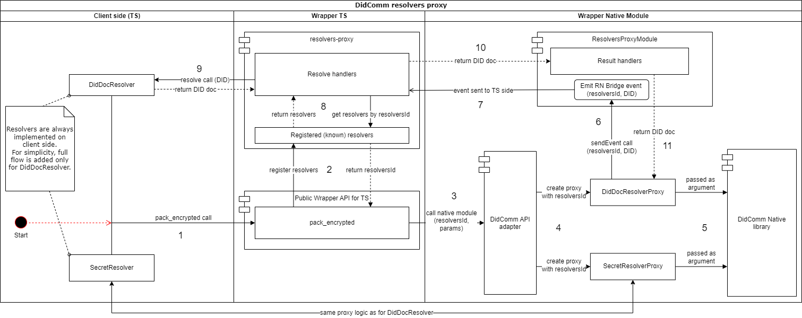

# DidComm resolvers Proxy

This document covers most complex part of `didcomm-react-native` package design that related to `JS <-> Native code` communication.

## Reason

This whole monster solution is required to simply connect DidComm resolvers on JS side (`DidDocResolver` and `SecretResolver`) and corresponding proxies on native side (`DidDocResolverProxy` and `SecretResolverProxy`).

## Solution

Implemented solution diagram presented below:

### Step 1

Client side calls `didcomm-react-native` public API passing `DidDocResolver` and `SecretResolver` instances as arguments (on a diagram it's `pack_encrypted` call).

### Step 2

Before calling native module methods, wrapper registers resolvers instances on it's TS side.
This is done by using `resolvers-proxy` TS module that generates unique `resolversId` for resolvers instances pair saves it in a Map (in-memory), returning `resolversId` to the caller.

### Step 3

Wrapper TS API calls native module method passing `resolversId` amount others DidComm API args.

### Step 4

DidComm API adapter on native side creates/parses objects required for DidComm Native library. As a part of that, it creates resolvers proxy instances (`DidDocResolverProxy` and `SecretResolverProxy`) that are storing `resolversId` value and also implementing resolvers interfaces required in DidComm Native library.

### Step 5

DidComm API adapter calls DidComm Native library and passes resolvers proxy instances as arguments.

### Step 6

#### Note: this and following steps described for `DidDocResolverProxy`, `SecretResolverProxy` has the same logic and use the same modules

At some point, DidComm implementation will need to resolve `DIDDoc` and will call `DidDocResolverProxy.resolve` that will call `ResolversProxyModule.sendEvent`, passing `resolversId` and `did` that needs to be resolved.

### Step 7

`ResolversProxyModule` will emit RN Bridge event with `ResolveDid` type that contains `resolversId` and `did` values. This event will be sent to wrapper TS side.

### Step 8

On TS side, `resolvers-proxy` will start handle `ResolveDid` event. It will go to registered resolvers Map and get resolvers pair by provided `resolversId`. Then, it will get `DidDocResolver` instance from this pair.

### Step 9

`resolvers-proxy` handler will call `resolve` method of found `DidDocResolver` instance and get resolved `DIDDoc` as a result.

### Step 10

Resolved `DIDDoc` will be passed back to `ResolversProxyModule` on a native side by calling one of result handler methods (in this case, `setResolvedDid`).

### Step 11

On a native side, `ResolversProxyModule` passes resolved `DIDDoc` value to `DidDocResolverProxy` that will return it in DidComm Native library as a result of `DidDocResolverProxy.resolve`.
